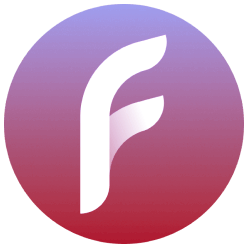

<div align="center">

<h1>FlowConfig</h1>
<p>A simple app that can change the language of Zepp Flow to any language you want (including unsupported ones).</p>
</div>

## Build from sources
NodeJS required

```bash
# Install toolchain
npm i -g zeusx @zeppos/zeus-cli @zeppos/zpm

# Prepare sources
git clone https://github.com/melianmiko/FlowConfig.git
cd FlowConfig
npm i

# Build and get preview QR code
zeusx preview

# ...or use any other zeusx build-install mode
```
